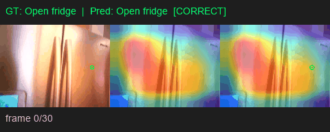
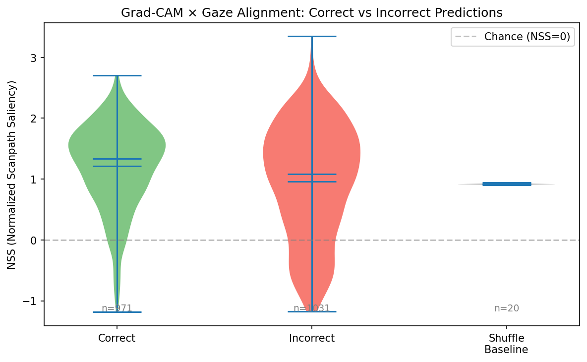

# Gaze-CAM

Comparing where video action-recognition models "look" (via Grad-CAM / Attention-CAM) to where the human actor looked (via eye tracking), using the [EGTEA Gaze+](http://cbs.ic.gatech.edu/fpv/) egocentric cooking dataset.

<p align="center">
  
  <br>
  <em>Grad-CAM heatmap (model attention) with human gaze point overlay</em>
</p>

## Research Questions

1. When the model predicts correctly, does its attention overlap with human gaze more than when it predicts incorrectly?
2. Does the model's attention lead or lag behind human gaze in time?
3. Does the type of error (wrong verb vs. wrong noun) affect gaze-CAM alignment?
4. How do different architectures (CNN vs. transformer) compare in gaze alignment?

## Supported Models

| Architecture | Family | Saliency Method | Frames | Resolution |
|---|---|---|---|---|
| **R3D-18** | 3D CNN | Grad-CAM | 16 | 112×112 |
| **SlowFast R50** | 3D CNN (two-stream) | Grad-CAM | 32 (slow 8 + fast 32) | 224×224 |
| **TimeSformer** | Video Transformer | Attention-CAM | 8 | 224×224 |
| **ViViT** | Video Transformer | Attention-CAM | 32 | 224×224 |

All models are pretrained on Kinetics-400 and fine-tuned on EGTEA Gaze+.

## Method

- **Explainability:** Grad-CAM (conv models) or CLS→patch attention rollout (transformers), producing per-frame spatial heatmaps
- **Gaze data:** 30 Hz eye-tracking from EGTEA Gaze+ (BeGaze format)
- **Alignment metrics:** NSS (Normalized Scanpath Saliency), AUC-Judd, with shuffle baseline
- **Analysis:** Correct vs. incorrect comparison, verb/noun error bucketing, temporal lead/lag shifts

## Project Structure

```
gaze_cam/                  # Python package (library code)
  __init__.py
  config.py                - Paths, hyperparameters, per-model configs
  dataset.py               - PyTorch Dataset / DataLoader for EGTEA clips
  gaze_utils.py            - Gaze file loading, timecode parsing, coordinate mapping
  video_utils.py           - Video decoding and arch-specific preprocessing
  model.py                 - Multi-arch model builder, training, checkpointing
  gradcam.py               - GradCAM3D + AttentionCAM + factory

scripts/                   # CLI entry points (all accept --model)
  train.py                 - Train a model
  train_resilient.py       - Auto-restart wrapper for crash-prone training
  evaluate.py              - Predictions + CAM grids
  analysis.py              - Full alignment analysis pipeline (NSS, AUC, plots)
  visualize.py             - Gaze + CAM overlay images and GIFs
  inspect_data.py          - Quick dataset sanity checks
  run_pipeline.py          - End-to-end (train -> evaluate -> visualize)

notebooks/                 # Exploratory notebooks
  Gaze_CAM.ipynb           - R3D-18 / TimeSformer / ViViT experiments
  Slow_fast_full.ipynb     - SlowFast R50 experiments
```

## Setup

```bash
# Clone and install dependencies
git clone https://github.com/<your-username>/gaze-cam.git
cd gaze-cam
pip install -r requirements.txt
```

### Dataset

Download [EGTEA Gaze+](http://cbs.ic.gatech.edu/fpv/) and place it under `data/`:

```
data/EGTEA Gaze+/
  action_annotation/
    raw_annotations/action_labels.csv
    train_split1.txt ... train_split3.txt
    test_split1.txt  ... test_split3.txt
  gaze_data/gaze_data/*.txt
  video_clips/cropped_clips/<session>/*.mp4
```

## Usage

Every script accepts `--model {r3d18, slowfast_r50, timesformer, vivit}` (default: `r3d18`).

### Train
```bash
python scripts/train.py --split 1 --model r3d18
python scripts/train.py --split 1 --model slowfast_r50
python scripts/train.py --split 1 --model timesformer
python scripts/train.py --split 1 --model vivit
```
Saves per-epoch checkpoints to `outputs/`. Per-model configs (batch size, learning rate, epochs) are set in `gaze_cam/config.py`.

For long/crash-prone runs (e.g. ViViT), use the resilient wrapper that auto-restarts on crash:
```bash
python scripts/train_resilient.py --model vivit --split 1
```

### Evaluate + CAM grids
```bash
python scripts/evaluate.py --split 1 --model r3d18 --save-cam-grids
```

### Full alignment analysis
```bash
python scripts/analysis.py --split 1 --model r3d18 --max-test 0 --lag-range 5 --n-shuffles 20
```
Produces:
- `outputs/analysis/alignment_<model>_split1.csv` – per-clip metrics
- Violin plots, error buckets, temporal lag curves, per-verb breakdown

### Visualizations
```bash
python scripts/visualize.py --split 1 --model r3d18 --num-clips 8 --gifs
```

### Full pipeline
```bash
python scripts/run_pipeline.py --split 1 --model r3d18 --save-cam-grids
```

## Training Results (Split 1, 30 epochs)

| Model | Type | Final Acc | Best Acc (epoch) | Batch | LR | Time / Epoch |
|-------|------|-----------|------------------|-------|------|-------|
| **R3D-18** | 3D CNN | 48.3% | — | 16 | 3e-4 | ~0.5 min |
| **SlowFast R50** | 3D CNN | 58.2% | 59.5% (ep 24) | 16 | 5e-4 | ~2 min |
| **TimeSformer** | Transformer | 61.2% | 63.2% (ep 19) | 8 | 2e-5 | ~2.2 min |
| **ViViT** | Transformer | 63.6% | 64.4% (ep 8) | 1×4 accum | 2e-5 | ~13 min |

All models trained on EGTEA Gaze+ action recognition (1,170 classes), 8,299 train / 2,022 test clips.
Transformer models outperform CNNs, with ViViT achieving the highest accuracy.

### Pretrained Weights

Pretrained checkpoints are included in `outputs/` (tracked via Git LFS):

| File | Size |
|------|------|
| `outputs/r3d18_egtea_split1.pt` | 129 MB |
| `outputs/slowfast_r50_egtea_split1.pt` | 139 MB |
| `outputs/timesformer_egtea_split1.pt` | 466 MB |
| `outputs/vivit_egtea_split1.pt` | 342 MB |

To use a pretrained checkpoint without retraining:
```python
from gaze_cam.model import build_model, load_or_train
from gaze_cam.dataset import make_loaders

train_loader, test_loader, l2i, i2l, n_act = make_loaders(split=1, arch="vivit")
model = build_model("vivit", n_act)
# load_or_train automatically loads the checkpoint if it exists
model = load_or_train(model, train_loader, test_loader, l2i, i2l, n_act, arch="vivit", split=1)
```

## Gaze-CAM Alignment (R3D-18, Split 1)

<p align="center">
  
</p>

| Condition | NSS | AUC | n |
|-----------|-----|-----|---|
| Overall | 1.08 | 0.77 | 2,002 |
| Correct | 1.21 | 0.81 | 971 |
| Incorrect | 0.96 | 0.74 | 1,031 |
| Shuffle baseline | ~0.0 | ~0.5 | – |

- **Mann-Whitney U test:** p < 0.000001, rank-biserial r = −0.15
- **Error buckets:** Wrong-noun errors (NSS=0.96) show lower alignment than wrong-verb errors (NSS=1.21)
- **Temporal shift:** Flat curve across ±5 frames — no meaningful lead or lag

## Requirements

- Python 3.10+
- NVIDIA GPU with CUDA (tested on RTX 5090)
- See [requirements.txt](requirements.txt) for packages

### Core dependencies
- PyTorch 2.x + torchvision
- pytorchvideo (SlowFast)
- transformers + accelerate (TimeSformer, ViViT)
- imageio, opencv, matplotlib, pandas, scipy, tqdm

## License

This project is for academic/research purposes using the EGTEA Gaze+ dataset.
Please cite the original dataset paper if you use this work:

> Li, Y., Liu, M., & Rehg, J. M. (2018). In the Eye of Beholder: Joint Learning of Gaze and Actions in First Person Video. *ECCV 2018*.
